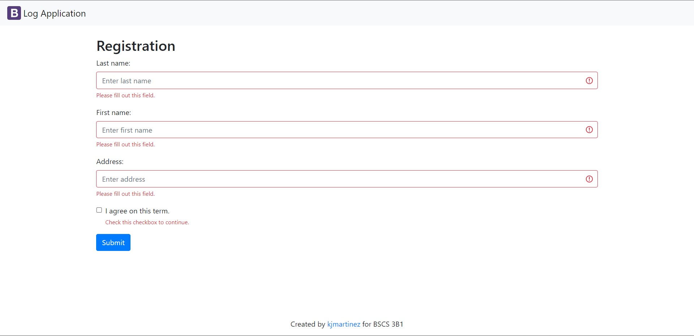
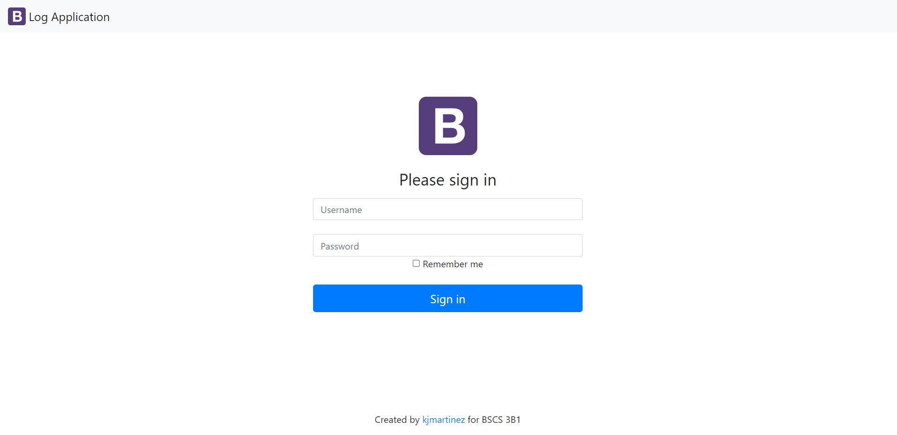
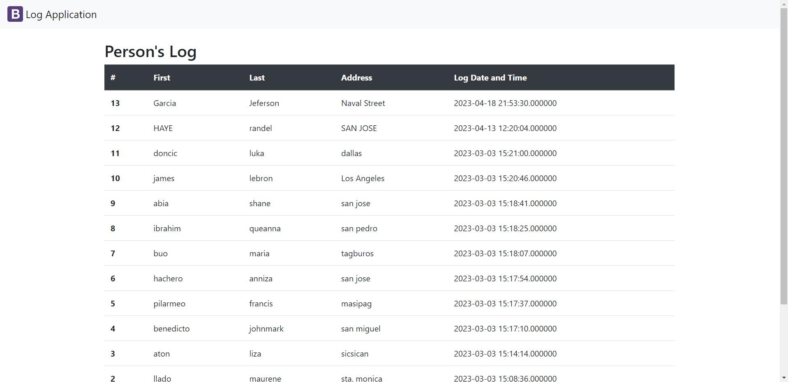

# LogApp 
___A log application, also known as a logging application, is a software tool used to record and store various types of data, such as events, errors, or user actions. The primary purpose of a log application is to provide a mechanism for developers, system administrators, or other stakeholders to monitor and troubleshoot applications or systems.___ 

# Visuals
 

 

 

# Installation 

* Download and install XAMPP on your computer.

* Start the XAMPP Control Panel and Start the Apache and MySQL modules.

* Open a web browser and navigate to http://localhost/phpmyadmin/.

* Create a new database in phpMyAdmin.

* Import the .sql file into the new database.

* Configure the database connection in your web application.

* Test the connection and functionality of your web application.

 

# Authors  
   

## Randel Vitero

  

## Liza May Aton

  

# John Mark Benedicto

